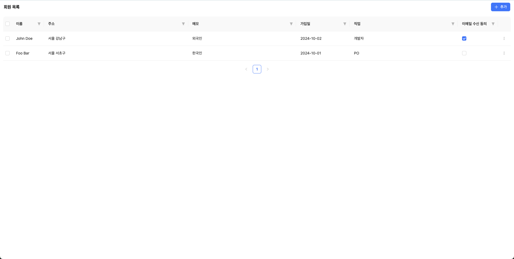
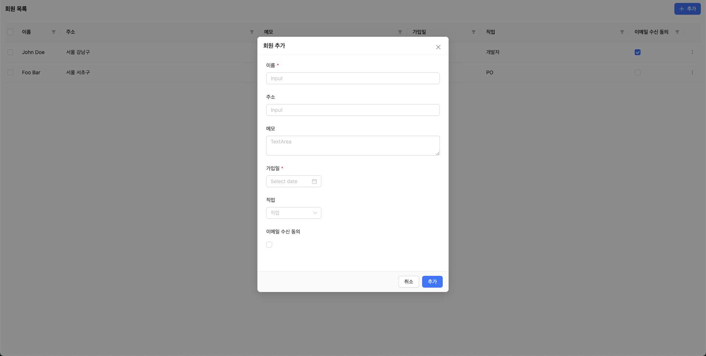
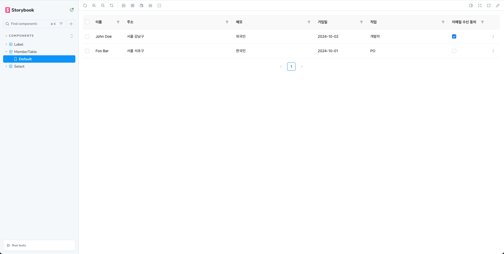

## 회원 목록 관리 테이블

### 개요

회원 목록을 관리할 수 있는 테이블 기능이 제공됩니다.<br>
회원 추가, 수정, 삭제가 가능하며, 각 필드에 대한 필터 기능을 제공합니다.

### 기능

- 회원 목록 테이블 조회
- 회원 추가, 수정, 삭제 기능 제공
- 각 필드별 필터 기능 제공
- 입력값에 대한 유효성 검사
  - 이름, 주소: 최대 20자
  - 메모: 최대 50자
- 저장 방식 선택 가능: In-memory 또는 Local Storage
  - Local Storage 모드에서는 브라우저 새로고침 및 서버 재기동 시 데이터 보존

### 기술 스택

> 본 프로젝트는 `Vite` + `React` + `TypeScript` + `Ant Design` 기반으로 개발하였습니다.<br>

- 언어: `TypeScript`
- 프레임워크: `React`
- 컴포넌트 라이브러리: `Ant Design`
- 상태 관리: (외부 라이브러리 미사용)
- 스타일링: `Emotion`, `Ant Design Theme`
- 린팅: `ESLint`, `Prettier`
- 번들러: `Vite`

### 실행 방법

1. 의존성 설치

```bash
npm install
```

2. 서버 실행 (Storage 선택)

- In-memory

```bash
npm run dev:memory
```

- Local Storage (데이터 보존)

```bash
npm run dev:local
```
혹은

```bash
npm run dev
```

### 디렉토리 구조

```
src/
├── components/
│   ├── Label.tsx
│   ├── MemberFormModal.tsx
│   ├── MemberTable.tsx
│   └── Select.tsx
├── constans/
│   ├── initialMembers.ts
│   └── storageMode.ts
├── hooks/
│   └── useRecordStorage.ts
├── models/
│   ├── field.ts
│   └── member.ts
├── storage/
│   ├── InMemoryProvider.ts
│   ├── LocalStorageProvider.ts
│   └── StorageInterface.ts
├── utils/
│   └── keyUtil.ts
├── App.tsx
├── main.tsx
└── index.css
```

### 테스트 환경

- 운영체제
  - macOS 버전 15.3.2 (24D81)
- 브라우저
  - Arc 버전 1.90.1 (61364), Chromium Engine Version 135.0.7049.85
  - Chrome 버전 135.0.7049.42(공식 빌드) (arm64)
 
### 결과 화면

| 화면 | 설명 |
|:---|:---|
|  | 회원 목록 |
|  | 회원 추가 |
|  | Storybook |
